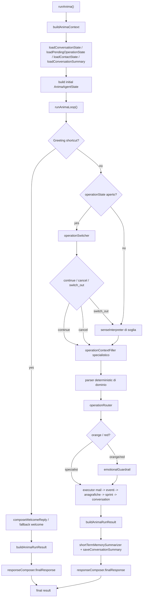

# Flusso Agentico Di Anima

## Scopo
Questo documento descrive il runtime agentico reale di Anima, come gira oggi nel codice.

Obiettivi del runtime:
- mantenere la conversazione naturale
- instradare il turno verso un dominio specialistico
- compilare JSON operativi rigorosi solo dove serve
- usare il deterministic come safety layer, persistenza ed esecuzione
- ridurre il contesto passato ai nodi specialistici

File sorgente di riferimento:
- entrypoint: [runAnima.ts](/C:/EvolveDevs/it.evolve.atlas.nfcPlatform/src/server-utils/anima/runAnima.ts)
- loop principale: [agentLoop.ts](/C:/EvolveDevs/it.evolve.atlas.nfcPlatform/src/server-utils/anima/core/agentLoop.ts)
- stato agente: [agentState.ts](/C:/EvolveDevs/it.evolve.atlas.nfcPlatform/src/server-utils/anima/core/agentState.ts)
- persistenza risultato e memoria breve: [stateHelpers.ts](/C:/EvolveDevs/it.evolve.atlas.nfcPlatform/src/server-utils/anima/core/stateHelpers.ts)

## Principi
- `senseInterpreter` decide il dominio, non compila i campi
- quando l'utente parla di task, compiti, todo o cose da fare, il dispatcher deve aprire il dominio taskboard
- i branch specialistici compilano e validano solo il proprio JSON
- i registry sono segnale forte di dominio, non solo materiale descrittivo
- i pending state tengono il bot focalizzato
- il contesto viene ristretto quando si entra in un dominio specialistico
- il debug deve raccontare perche un nodo ha scelto una certa strada

## Flow Reale

## Entry Point
`runAnima()` prepara tutto cio che il loop deve sapere prima di prendere decisioni.

Legge:
- contesto di sessione e canale tramite `buildAnimaContext(...)`
- `conversationState`
- `operationState`
- `contactState`
- `conversationSummary`

Costruisce:
- `authContext`
- `resolverMode`
- `AnimaAgentState` iniziale

Non decide nulla sul contenuto del turno. E solo bootstrap.

## Stato Agente
Lo stato condiviso dell'esecuzione di turno e `AnimaAgentState`.

Campi chiave:
- `context`: input, utente, sessione, canale, debug options
- `originalMessage`: testo originale del turno
- `authContext`: permessi applicativi
- `conversationState`: saluto e stato base sessione
- `operationState`: eventuale pending state specialistico
- `contactState`: rubrica di sessione ricavata da anagrafiche lette
- `conversationSummary`: memoria breve consolidata
- `senseInterpretation`: decisione pre-operazionale
- `operationArbitration`: decisione keep/drop sul task aperto
- `operationContextFill`: patch strutturata estratta dal turno
- `operationRouting`: branch scelto dal router
- `operationExecution`: esito tecnico del branch executor
- `llmTrace`: trace di tutti i nodi LLM

Riferimento: [agentState.ts](/C:/EvolveDevs/it.evolve.atlas.nfcPlatform/src/server-utils/anima/core/agentState.ts)

## Memorie
Anima usa quattro memorie principali.

### 1. Conversation State
Tiene informazioni leggere di sessione:
- `hasWelcomed`
- `stage`
- `updatedAt`

Uso:
- evita saluti duplicati
- permette un welcome contestuale al primo turno

Riferimento: [conversationState.ts](/C:/EvolveDevs/it.evolve.atlas.nfcPlatform/src/server-utils/anima/memory/conversationState.ts)

### 2. Pending Operation State
Tiene il task specialistico aperto.

Operazioni supportate:
- `event_create`
- `event_list`
- `mail_followup`
- `generic_mail`
- `sprint_timeline_read`
- `anagrafiche_read`
- `anagrafiche_create`

Nota:
- il nome interno `sprint_timeline_read` corrisponde al taskboard mode conversazionale
- il taskboard mode oggi copre anche domande manageriali come `chi sta facendo cosa`, `siamo in ritardo?`, `cosa faccio prima?`, `da quanti passaggi e composto un task?`

Ogni pending contiene:
- `operation`
- `phase`
- `readiness`
- `data`
- `missing`
- `updatedAt`

Uso:
- continua un task multi-turno
- riduce contesto e domande ridondanti
- abilita la logica di switch

Riferimento: [sessionState.ts](/C:/EvolveDevs/it.evolve.atlas.nfcPlatform/src/server-utils/anima/memory/sessionState.ts)

### 3. Contact State
Tiene i contatti emersi da `anagrafiche_read`.

Campi:
- `recordId`
- `typeSlug`
- `typeLabel`
- `displayName`
- `emails`
- `phones`

Uso:
- permette follow-up tipo `mandagli una mail`
- permette `alla sua mail` o `alla mail di quel fornitore` senza richiedere di nuovo l'indirizzo

Riferimento: [contactState.ts](/C:/EvolveDevs/it.evolve.atlas.nfcPlatform/src/server-utils/anima/memory/contactState.ts)

### 4. Conversation Summary
E la memoria breve riassunta dopo ogni turno.

Uso:
- dare continuita al tono
- ricordare risultati o stato del task
- evitare di passare tutti i turni storici ai nodi LLM

Riferimento: [shortTermMemory.ts](/C:/EvolveDevs/it.evolve.atlas.nfcPlatform/src/server-utils/anima/nodes/shortTermMemory.ts)

## Registry Awareness
Anima vede sempre i registry reali del sistema.

Domini caricati:
- `Anagrafiche`
- `Aule`
- `Eventi`

Builder:
- [registryAwareness.ts](/C:/EvolveDevs/it.evolve.atlas.nfcPlatform/src/server-utils/anima/core/registryAwareness.ts)

Funzioni chiave:
- `buildRegistryAwareness()`: ritorna il quadro completo
- `buildScopedRegistryAwareness(scope)`: restringe il contesto a:
  - `all`
  - `anagrafiche`
  - `eventi`
  - `sprint_timeline`

Uso reale:
- `senseInterpreter` riceve il quadro completo per capire il dominio
- `responseComposer` riceve il quadro scoped in base all'operazione
- `emotionalGuardrail` riceve il quadro completo per capire se il turno e vagamente in-domain
- il dispatcher usa `Task` anagrafica solo per richieste esplicitamente anagrafiche; richieste come `task futuri`, `compiti`, `cose da fare` vanno invece nel dominio taskboard

## Strategia Di Contesto
Il runtime cerca di non trascinarsi dietro troppo contesto.

Regole correnti:
- se non c'e un'operazione attiva, `senseInterpreter` riceve pochissimi `recentTurns`
- se c'e un pending, il primo nodo e `operationSwitcher`, non il classificatore di soglia
- se c'e un pending, i nodi specialistici ricevono solo gli ultimi turni utili
- i responder specialistici ricevono `registryAwareness` scoped
- il `finalResponse` evita di portarsi dietro storico inutile quando sta chiudendo un'operazione focalizzata

Ottimizzazioni token oggi attive:
- `recentTurns` ridotti al minimo utile per nodo
- `conversationSummary` vuota o scoped nei rami specialistici
- `registryAwareness` ristretto al dominio attivo
- `operationResult` compattato prima del `responseComposer.finalResponse`
- `llama-4-scout-17b-16e-instruct` come default Groq safe per ridurre retry e failover

Funzioni chiave:
- `getScopedRecentTurnsForSense(...)`
- `getScopedSummaryForSense(...)`
- `getScopedRecentTurnsForSpecialist(...)`
- `getScopedSummaryForSpecialist(...)`

Riferimento: [agentLoop.ts](/C:/EvolveDevs/it.evolve.atlas.nfcPlatform/src/server-utils/anima/core/agentLoop.ts)

## Nodi Del Flusso

### 1. Greeting Shortcut
Responsabilita:
- intercettare il saluto iniziale
- aprire la sessione in modo naturale

Input:
- `originalMessage`
- `conversationState.hasWelcomed`

Output:
- `welcome_greeting`

Usa:
- `detectGreeting(...)`
- `buildWelcomeReply(...)` come fallback deterministic
- `composeWelcomeReply(...)` come welcome LLM

Riferimenti:
- [agentLoop.ts](/C:/EvolveDevs/it.evolve.atlas.nfcPlatform/src/server-utils/anima/core/agentLoop.ts)
- [responseComposer.ts](/C:/EvolveDevs/it.evolve.atlas.nfcPlatform/src/server-utils/anima/nodes/responseComposer.ts)
- [conversation.ts](/C:/EvolveDevs/it.evolve.atlas.nfcPlatform/src/server-utils/anima/responders/conversation.ts)

### 2. Operation Switcher
Responsabilita:
- vivere solo quando esiste un pending state
- decidere se il messaggio continua il task aperto
- decidere se lo annulla
- decidere se va lasciato andare verso una nuova operazione
- produrre una patch gia compatibile con il filler del dominio
- evitare roundtrip LLM inutili quando il messaggio e gia chiaro ad alta confidenza

Input:
- messaggio utente
- recent turns scoped
- memoria breve
- `operationState`
- registry scoped del dominio attivo

Output:
- `decision`: `continue` | `switch_out` | `cancel`
- `normalizedMessage`
- `shouldSubmit`
- `fillLike`
- `confidence`
- `why`

Regola:
- se esiste un pending, questo nodo viene prima del classificatore generale

Fast path deterministici attivi:
- `event_create -> switch_out` se il messaggio e chiaramente una ricerca eventi
- `event_list -> continue` se il messaggio raffina tipo, periodo, `tutti` o `limit`
- `anagrafiche_read -> continue` se il messaggio completa query, selezione record o campi richiesti
- `anagrafiche_read/anagrafiche_create -> switch_out` se il messaggio passa chiaramente al dominio eventi
- `sprint_timeline_read -> continue` se il messaggio raffina scope, priorita, scadenza, breakdown o owner overview
- `mail_followup -> continue` se il messaggio conferma, rifiuta o specifica il destinatario
- `generic_mail -> continue` se il messaggio completa destinatario, oggetto o contenuto

Principio:
- se il nodo ha confidenza alta e il significato e strutturalmente evidente, continua o rilascia subito
- le domande o i processi di dubbio si attivano solo quando l'incertezza e reale

Riferimento: [operationSwitcher.ts](/C:/EvolveDevs/it.evolve.atlas.nfcPlatform/src/server-utils/anima/nodes/operationSwitcher.ts)

### 3. Sense Interpreter
Responsabilita:
- classificare il turno prima di entrare in un dominio
- decidere la capability di soglia quando non stiamo gia continuando un pending
- scegliere la capability piu probabile
- lasciare una motivazione breve in debug

Input:
- messaggio utente
- summary breve
- ultimi turni recenti scoped
- eventuale pending state
- registry awareness

Output:
- `route`
- `operationDecision`
- `likelyCapability`
- `normalizedMessage`
- `guardrailColor`
- `confidence`
- `why`

Non deve fare:
- compilazione campi
- selezione definitiva dei campi del JSON
- esecuzione

Note implementative:
- ha una normalizzazione post-LLM per riallineare alias o valori fuori schema
- contiene euristiche di correzione per evitare collisioni note, per esempio `Task` anagrafico vs SprintTimeline

Riferimento: [senseInterpreter.ts](/C:/EvolveDevs/it.evolve.atlas.nfcPlatform/src/server-utils/anima/nodes/senseInterpreter.ts)

### 4. Operation Arbitration
Responsabilita:
- decidere se mantenere il pending attivo o dropparlo

Input:
- `operationState`
- esito di `senseInterpreter`
- messaggio originale

Output:
- `keep`
- `drop_active`

Regole:
- entra in gioco soprattutto quando il pending e gia stato rilasciato allo strato di soglia
- se il sense non chiede `open_new`, il pending resta
- se la nuova capability e chiara e diversa, il pending viene chiuso
- alcune read operation possono essere riavviate anche nello stesso dominio se il messaggio e una nuova richiesta vera

Riferimento: funzione `resolveOperationArbitration(...)` in [agentLoop.ts](/C:/EvolveDevs/it.evolve.atlas.nfcPlatform/src/server-utils/anima/core/agentLoop.ts)

### 5. Operation Context Filler
Responsabilita:
- estrarre una patch JSON specifica per il branch
- farlo in modo conversazionale, ma rigoroso

Filler disponibili:
- `runOperationContextFillerForCreate`
- `runOperationContextFillerForEventList`
- `runOperationContextFillerForMailFollowup`
- `runOperationContextFillerForGenericMail`
- `runOperationContextFillerForSprintTimelineRead`
- `runOperationContextFillerForAnagraficheRead`
- `runOperationContextFillerForAnagraficheCreate`

Input:
- messaggio
- summary scoped
- recent turns scoped
- pending state del dominio

Output:
- `normalizedMessage`
- `payloadPatch` o `queryPatch`
- `confidence`
- `why`

Note:
- riceve e puo fondere la patch prodotta da `operationSwitcher`
- il filler puo omettere dettagli non necessari
- non deve inventare campi non presenti nel dominio
- in alcuni casi usa resolver ausiliari, per esempio `catalogResolver`

Riferimento: [operationContextFiller.ts](/C:/EvolveDevs/it.evolve.atlas.nfcPlatform/src/server-utils/anima/nodes/operationContextFiller.ts)

### 6. Catalog Resolver
Responsabilita:
- scegliere uno slug o label in una lista chiusa di candidati

Uso tipico:
- type evento
- type anagrafica

Input:
- frammento testuale
- `entityName`
- lista candidati `{ id, label, aliases }`

Output:
- `choiceId`
- `confidence`
- `why`

Nota:
- e un nodo LLM dedicato, ma limitato a una scelta chiusa
- viene usato come utilita interna dei filler, non come fase conversazionale autonoma
- semanticamente fa parte della compilazione del dominio

Riferimento: [catalogResolver.ts](/C:/EvolveDevs/it.evolve.atlas.nfcPlatform/src/server-utils/anima/nodes/catalogResolver.ts)

### 7. Parser Deterministici
Responsabilita:
- fare fallback strutturale
- validare o rafforzare il segnale del filler

Parser principali:
- `parseEventCreateIntent`
- `parseEventListIntent`
- `parseRecentEventsIntent`
- `parseAnagraficheReadIntent`
- `parseAnagraficheCreateIntent`
- `parseSprintTimelineReadIntent`
- `parseGenericMailIntent`

Ruolo attuale:
- non sono il cervello principale
- restano importanti per robustezza e per i casi semplici

Riferimenti:
- `features/eventi/*`
- `features/anagrafiche/*`
- `features/sprintTimeline/*`
- `features/mail/genericMail.ts`

### 8. Operation Router
Responsabilita:
- scegliere il branch operativo finale

Input:
- pending state
- guardrail stateful
- sense interpretation
- esiti parser deterministici
- segnali mail / digest / low-value

Output:
- `branch`
- `reason`
- `usedSignals`

Branch principali:
- `event_create_flow`
- `event_list`
- `event_recent`
- `mail_followup_pending`
- `generic_mail_pending`
- `generic_mail_new`
- `mail_digest`
- `anagrafiche_read`
- `anagrafiche_create`
- `sprint_timeline_read`
- `orange_guardrail`
- `not_understood`

Nota:
- l'ordine conta
- oggi SprintTimeline viene fatto prevalere su `Task` anagrafico nelle frasi operative sui task

Riferimento: [operationRouter.ts](/C:/EvolveDevs/it.evolve.atlas.nfcPlatform/src/server-utils/anima/nodes/operationRouter.ts)

### 9. Emotional Guardrail
Responsabilita:
- separare `orange` da `red` quando il router non ha ancora un dominio chiaro

Input:
- messaggio
- summary
- recent turns
- sense interpretation
- active operation
- registry awareness

Output:
- `guardrailColor`
- `responseMode`
- `confidence`
- `why`

Quando gira:
- solo sui casi ambigui o non compresi

Riferimento: [emotionalGuardrail.ts](/C:/EvolveDevs/it.evolve.atlas.nfcPlatform/src/server-utils/anima/nodes/emotionalGuardrail.ts)

### 10. Domain Executors
Il demux del loop prova gli executor in quest'ordine:
1. mail
2. eventi
3. anagrafiche
4. sprint timeline
5. conversation fallback

Riferimento: [agentLoop.ts](/C:/EvolveDevs/it.evolve.atlas.nfcPlatform/src/server-utils/anima/core/agentLoop.ts)

#### 9.1 Mail Executor
Responsabilita:
- gestire `generic_mail`
- gestire `mail_followup`
- gestire digest e promemoria
- usare la rubrica implicita da anagrafiche quando possibile

Riferimento: [mail.executor.ts](/C:/EvolveDevs/it.evolve.atlas.nfcPlatform/src/server-utils/anima/features/mail/mail.executor.ts)

#### 9.2 Eventi Executor
Responsabilita:
- creare eventi
- listare eventi
- riassumere eventi recenti
- aprire chiarifiche operative quando mancano campi

Riferimento: [eventi.executor.ts](/C:/EvolveDevs/it.evolve.atlas.nfcPlatform/src/server-utils/anima/features/eventi/eventi.executor.ts)

#### 9.3 Anagrafiche Executor
Responsabilita:
- leggere anagrafiche
- creare anagrafiche
- chiedere `tipo`, `record`, `campi`
- ricordare email e telefoni trovati

Riferimento: [anagrafiche.executor.ts](/C:/EvolveDevs/it.evolve.atlas.nfcPlatform/src/server-utils/anima/features/anagrafiche/anagrafiche.executor.ts)

#### 9.4 Sprint Timeline Executor
Responsabilita:
- interpretare richieste sui task attivi, in scadenza, prioritari
- mantenere il task come unita primaria
- trattare checkpoint e blocchi come passaggi del task
- delegare l'ordinamento allo scheduler
- generare advisory sul task migliore da attaccare

Riferimenti:
- [sprintTimeline.executor.ts](/C:/EvolveDevs/it.evolve.atlas.nfcPlatform/src/server-utils/anima/features/sprintTimeline/sprintTimeline.executor.ts)
- [sprintTimeline.scheduler.ts](/C:/EvolveDevs/it.evolve.atlas.nfcPlatform/src/server-utils/anima/features/sprintTimeline/sprintTimeline.scheduler.ts)
- [sprintTimeline.advisor.ts](/C:/EvolveDevs/it.evolve.atlas.nfcPlatform/src/server-utils/anima/features/sprintTimeline/sprintTimeline.advisor.ts)

#### 9.5 Conversation Executor
Responsabilita:
- fallback finale
- low-value
- orange reply
- not understood
- cancel di operazioni

Riferimento: [conversation.executor.ts](/C:/EvolveDevs/it.evolve.atlas.nfcPlatform/src/server-utils/anima/features/conversation/conversation.executor.ts)

### 11. Short-term Memory Summarizer
Responsabilita:
- aggiornare la memoria breve dopo ogni risultato

Come viene chiamato:
- dentro `buildAnimaRunResult(...)`

Fallback:
- se il nodo LLM fallisce, costruisce una sintesi deterministicamente

Persistenza:
- salva in `summaryState`

Strategia:
- la memoria breve e centrata sull'utente e sul task
- ogni turno parte dalla `previousSummary`
- il nuovo scambio aggiorna la sintesi solo se aggiunge qualcosa di utile
- il riassunto serve a comprimere contesto, non a fare logging verboso

Riferimenti:
- [shortTermMemory.ts](/C:/EvolveDevs/it.evolve.atlas.nfcPlatform/src/server-utils/anima/nodes/shortTermMemory.ts)
- [stateHelpers.ts](/C:/EvolveDevs/it.evolve.atlas.nfcPlatform/src/server-utils/anima/core/stateHelpers.ts)

### 12. Response Composer
Responsabilita:
- trasformare il risultato tecnico del branch in una risposta umana

Varianti:
- `composeWelcomeReply`
- `composeOperationClarificationReply`
- `composeOrangeContextReply`
- `composeFinalResponse`

Input:
- `operationResult`
- `memorySupport`
- `responseGuidance`
- `registryAwareness` scoped

Output:
- testo finale per l'utente

Regole importanti:
- fuori da un'operazione specialistica conosce i domini in modo grossolano
- dentro un'operazione conosce lo stato di completamento del JSON e il prossimo passo utile
- se lo slug e gia deciso, riceve contesto stretto del dominio e non l'intero catalogo
- se c'e una `listingPresentation` verbatim, non deve riscrivere tutto da capo
- se `followUpPolicy = none`, non deve chiudere con menu standard
- il tono deve restare dentro il dominio attivo

Riferimenti:
- [responseComposer.ts](/C:/EvolveDevs/it.evolve.atlas.nfcPlatform/src/server-utils/anima/nodes/responseComposer.ts)
- [responseGuidance.ts](/C:/EvolveDevs/it.evolve.atlas.nfcPlatform/src/server-utils/anima/core/responseGuidance.ts)

## Branch Specialistici

### Eventi
Capacita:
- `event_create`
- `event_list`
- `event_recent`

Fonti:
- registry eventi
- parser temporali
- service evento

File principali:
- [eventi.create.ts](/C:/EvolveDevs/it.evolve.atlas.nfcPlatform/src/server-utils/anima/features/eventi/eventi.create.ts)
- [eventi.list.ts](/C:/EvolveDevs/it.evolve.atlas.nfcPlatform/src/server-utils/anima/features/eventi/eventi.list.ts)
- [eventi.time.ts](/C:/EvolveDevs/it.evolve.atlas.nfcPlatform/src/server-utils/anima/features/eventi/eventi.time.ts)
- [eventi.typeResolver.ts](/C:/EvolveDevs/it.evolve.atlas.nfcPlatform/src/server-utils/anima/features/eventi/eventi.typeResolver.ts)

### Mail
Capacita:
- mail libera
- follow-up dopo create evento
- digest eventi
- invio a contatto ricordato

File principali:
- [genericMail.ts](/C:/EvolveDevs/it.evolve.atlas.nfcPlatform/src/server-utils/anima/features/mail/genericMail.ts)
- [animaReminderMail.ts](/C:/EvolveDevs/it.evolve.atlas.nfcPlatform/src/server-utils/anima/features/mail/animaReminderMail.ts)
- [mail.executor.ts](/C:/EvolveDevs/it.evolve.atlas.nfcPlatform/src/server-utils/anima/features/mail/mail.executor.ts)

### Anagrafiche
Capacita:
- ricerca per tipo e query
- selezione record
- scelta campi
- create di nuova anagrafica
- alimentazione rubrica di sessione

File principali:
- [anagrafiche.read.ts](/C:/EvolveDevs/it.evolve.atlas.nfcPlatform/src/server-utils/anima/features/anagrafiche/anagrafiche.read.ts)
- [anagrafiche.create.ts](/C:/EvolveDevs/it.evolve.atlas.nfcPlatform/src/server-utils/anima/features/anagrafiche/anagrafiche.create.ts)
- [anagrafiche.executor.ts](/C:/EvolveDevs/it.evolve.atlas.nfcPlatform/src/server-utils/anima/features/anagrafiche/anagrafiche.executor.ts)

### Sprint Timeline
Capacita:
- task attivi
- task in scadenza
- task per owner / reviewer / persona specifica / azienda
- ordinamento operativo con scheduler
- suggerimento del task da fare per primo

File principali:
- [sprintTimeline.read.ts](/C:/EvolveDevs/it.evolve.atlas.nfcPlatform/src/server-utils/anima/features/sprintTimeline/sprintTimeline.read.ts)
- [sprintTimeline.scheduler.ts](/C:/EvolveDevs/it.evolve.atlas.nfcPlatform/src/server-utils/anima/features/sprintTimeline/sprintTimeline.scheduler.ts)
- [sprintTimeline.executor.ts](/C:/EvolveDevs/it.evolve.atlas.nfcPlatform/src/server-utils/anima/features/sprintTimeline/sprintTimeline.executor.ts)
- [sprintTimeline.advisor.ts](/C:/EvolveDevs/it.evolve.atlas.nfcPlatform/src/server-utils/anima/features/sprintTimeline/sprintTimeline.advisor.ts)

## Guardrail
Anima ha tre livelli di guardrail.

### Guardrail 1: continuita operativa
Mantiene il pending quando il turno sta ancora completando il task.

Componenti:
- [operationGuardrails.ts](/C:/EvolveDevs/it.evolve.atlas.nfcPlatform/src/server-utils/anima/core/operationGuardrails.ts)
- `operationState`

### Guardrail 2: switch
Decide se abbandonare il task attivo per aprirne uno nuovo.

Componenti:
- `senseInterpreter`
- `resolveOperationArbitration(...)`
- `operationRouter`

### Guardrail 3: attinenza
Capisce se la richiesta e:
- recuperabile con una domanda
- fuori dominio
- troppo povera o provocatoria

Componenti:
- `senseInterpreter.guardrailColor`
- `emotionalGuardrail`
- `conversation executor`

## Strategia LLM E Failover
Provider supportati dal runtime:
- `groq`
- `glm`

Layer centrale:
- [llm/index.ts](/C:/EvolveDevs/it.evolve.atlas.nfcPlatform/src/server-utils/llm/index.ts)

Funzioni importanti:
- `createRuntimeChatProvider(...)`
- `chatWithRuntimeFailover(...)`

Come funziona il failover:
- prova provider/model configurato per il nodo
- prova varianti del nodo
- puo provare il provider secondario se disponibile
- se trova un `429`, mette quel `provider:model` in cooldown
- salta i tentativi ancora in cooldown nei turni successivi

Scelta Groq attuale:
- modello safe di default: `meta-llama/llama-4-scout-17b-16e-instruct`

Riferimenti:
- [anima.runtime.config.ts](/C:/EvolveDevs/it.evolve.atlas.nfcPlatform/src/server-utils/anima/config/anima.runtime.config.ts)
- [llm.runtime.config.ts](/C:/EvolveDevs/it.evolve.atlas.nfcPlatform/src/server-utils/llm/llm.runtime.config.ts)

## Debug E Tracing
Ogni nodo LLM puo scrivere uno step in `llmTrace`.

Campi tipici:
- `step`
- `title`
- `reason`
- `provider`
- `model`
- `purpose`
- `systemPrompt`
- `input`
- `rawResponse`
- `parsedResponse`
- `status`
- `error`

In piu, il risultato finale porta nel debug:
- `senseInterpretation`
- `emotionalGuardrail`
- `operationArbitration`
- `operationContextFill`
- `operationRouting`
- `operationExecution`
- `contactState`
- `conversationSummaryBefore`
- `conversationSummaryAfter`

Riferimento: [stateHelpers.ts](/C:/EvolveDevs/it.evolve.atlas.nfcPlatform/src/server-utils/anima/core/stateHelpers.ts)

## Debug UI
La UI di `AnimaLab` espone due superfici diverse:

1. debug rapido
- mostra per step: nodo, modello, token input/output/totale e output raw sintetico
- resta visibile anche quando parte un nuovo turno, finche non viene sostituito

2. debug completo
- mostra il trace esteso con payload, system prompt, raw response e parsed response

Nota attuale:
- il debug rapido ha token reali per step
- il vero aggiornamento progressivo step-by-step mentre il backend sta ancora eseguendo richiede una route streaming o SSE dedicata

## Invarianti Da Mantenere
Quando si modifica il runtime, queste regole devono restare vere:
- il `senseInterpreter` non compila campi di dettaglio
- il branch specialistico e il luogo in cui si completa il JSON
- il task pending restringe il contesto, non lo allarga
- i registry restano sempre visibili al cervello centrale
- i debug reason devono essere brevi e leggibili
- il deterministic non deve tornare a essere il regista principale
- `Task` anagrafico e `task` SprintTimeline vanno tenuti distinti
- i contatti emersi da anagrafiche possono essere riusati nel dominio mail
